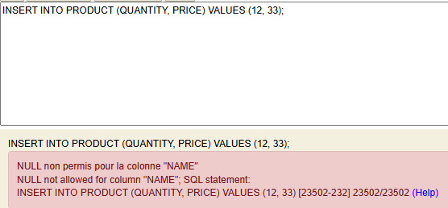

<h2 style="text-center">
TP 2 : création d'une application web JEE via Spring boot en utilisant 
Spring DATA, Spring MVC, Spring Security 
</h2>

<b>Objectif: </b>
Utilisation de Spring Security, pour gérer les droits d'utilisateurs et protéger les ressources d'une application, 
et pour ce mettre face contre la faille csrf

 
<h4>Les dépendances de l'application et leurs rôles</h4>
<ul>
<li><b>java jdk 17 : </b> Pour écrire et exécuter le code java</li>

<li><b>Spring Data JPA : </b> Pour faciliter le Mapping Object Relationnel</li>

<li><b>Spring Web : </b>Pour faciliter l'utilisation du design pattern MVC dans notre couche de présentation (web)</li>

<li><b>Spring Validation : </b>Pour la vadidation des données</li>

<li><b>Thymleaf : </b>Un moteur de template, pour établir les vues de notre application, 
et pour tirer parite des avantages d'un moteur de template : 
<ul>
	<li>Séparation de la logique métier et de la présentation ce qui facilite la maintenance</li>
	<li>Protection par défaut contre les injections XSS</li>
	<li>Support des blocks structurels (if, for ...)</li>
	<li>Répartition des résponsabilités (frontend VS backend)</li>
	<li>Réduire le temps de chargement de la page web via la mise en cache de la version compilé de cette dernière</li>
	<li>...</li>
</ul>

<li><b>h2 : </b> C'est un SGBDR qui permet de créer une base de données en mémoire (ou dans un fichier), ce qui est utile pour établir des testes fonctionnelles dans un environnement de developpement</li>

<li><b>mysql (avec le dialect MariaDB): </b> Un SGBD qui permet de créer une base de données dans le système de fichier d'un système d'exploitation (utilisé dans un environnement de production)</li>

<li><b>thymleaf-extras-springsecurity6 : </b> C'est un module Thymleaf qui permet d'integrer la sécurité basée sur <b>Spring Security</b> dans les vue thymleaf</li>

<li><b>lombock</b> : pour génerer les getters, setters, constructeurs... depuis des annotations Lambock</li>

<li><b>webjars</b> : pour integrer le css de bootstrap</li>

<li><b>Spring Boot </b> Est un module du framework Spring qui sont interêt est de simplifier, de centraliser et d'automatiser la configuration d'un projet basé sur Spring framework</li>
</ul>

 

<h4>Déscription de l'application</h4>
<h5>Les exigences fonctionnelles de l'application</h5>

<b>Diagramme de cas d'utilisation : </b>

<h5>Les exigences techniques de l'application</h5>

L'application doit empêcher les failles de sécurité suivantes : 
<ul>
<li>Les injections sql, en utilisant des requêtes paramètrées - Assuré par Spring Data JPA -</li>	
<li>Les injections des scripts javascript (XSS), en échapant toutes balise HTML qui provient depuis l'utilisateur - Assuré par le moteur de template Thymleaf -</li>
<li>La faille CSRF liée, en authentifiant à chaque fois une requête de type POST (ou autres méthodes artificielles : DELETE, PUT, PATCH ...) via un token CSRF- Assuré par défaut par Spring Security -</li>
</ul>

<h4>Réalisation :</h4>

<b>1 - Ajout des dependances suivantes : </b>

<ul>
<li>Spring Data (version )</li>
<li>Spring Security</li>
<li>Spring Validation</li>
<li>Spring Web</li>
<li>Thymleaf</li>
<li>H2Database</li>
<li>mysql</li>
<li>Lombok</li>
<li>webjars</li>
<li>Spring boot</li>
</ul>

 

<b>2 - Création de l'entité Product : </b>

La couche entité reflète la structure des tables dans une base de données, et la logique metier pure, souvent plus stable.
C'est pour cette raison que j'ai choisi de ne pas mettre la validation orientée contexte ou utilisateur (format, contraintes métier...) dans cette couche, mais 
de la mettre par la suite dans la couche DTO (Data Transfert Object).   
Parmis les avantages de cette séparation de résponsabilité sont : 
<ul>
	<li>Avoir un code (couche entité) fermé à la modification et ouvert à l'extension</li>
	<li>Réutilisation de la couche entité dans plusieurs contextes et application</li>
	<li>Les entités rèstent simples est ne se concentrent que sur la déscription de bas niveau de la base de données</li>
	<li>Modification des règles de validation sans modifier la base de données</li>
	<li>Avoir un code facilement maintenable</li>
</ul>

 

<b>3 - Création de l'interface ProductRepository basée sur Spring Data</b>

 

<b>4.Testes de la couche DAO</b>

Scénario 1 : Toutes les champs d'un produit satisfaient les contraintes définies dans l'entité Product et dans la DTO Product

Sortie : 

 

Scénario 2 : Le champs "name" est null

 

Scénario 3 : Le champs "price" est null

 

Scénario 4 : Le champs "quantity" est null

 

Scénario 5 : Le champs "price" est inférieur à 0

Sortie : 

 

Scénario 6 : produit par id

Sortie : 

 

Scénario 7 : suppréssion d'un produit

Sortie : 

 

Scénario 8 : Mise à jour d'un produit

Sortie : 

 

<b>5.Désactivation de la sécurité par défaut de Spring Security</b>

 

<b>6. Création du contrôleur spring MVC et les vues thymeleaf</b>

6 - 1 : Page d'accueil

 

6 - 2 : Page listing des produits

 

6 - 3 : détail d'un produit

 

6 - 4 : Page dashboard

 

6 - 5 : Ajout d'un produit (admin)

Scénario 1 : Les règles de validation ne sont pas satisfaites

Scénario 2 : succéssion de l'ajout

 

6 - 6 : Mise à jour d'un produit (admin)

Scénario 1 : Les règles de validation ne sont pas satisfaites

Scénario 2 : succéssion de la mise à jour

 

6 - 7 : Suppréssion d'un produit 

 

<b>7 - Sécurisation avec Spring Sécurity</b>

<ul>
<li>
Par défaut Spring security injecte dans les formulaires un input de type "hidden" qui a comme valeur un hash, qui 
permettera à ce dernier soit d'accépter la requête, ou de la rejeter si la vérification de ce hash échoue
</li>
<li>
Spring Security permet aussi de gérer les droits, et de protéger les ressources de l'application selon les 
rôles ou les persmissions des utilisateurs 
</li>
</ul>
 

Pour exploiter la gestion de droits/ressources, on a créer 3 utilisateurs avec trois roles différents :

<ul>
<li>VISITOR : le role "VISITOR" n'a le droit que d'accéder à la page d'accueil, et de lister les produits publiés</li>
<li>
USER : le role "USER" étends le rôle "VISITOR", il peut lister même les produits non publiés 
depuis la page dashboard, et ajouter un produit mais sous forme d'un brouillon (non publié)
</li>
<li>
ADMIN : le role "ADMIN" étends le rôle "USER", et il peut gérer les produits (ajout, publication, mise à jour, et suppréssion)
</li>
</ul>

Scénario 1 : Un utilisateur se connecte avec e role "VISITOR"

 

Un visitor peut accéder à la page d'accueil

 

Un visitor peut accéder à la page qui liste les produits publiés

 

Un visitor n'a pas le droit d'accéder au Dashboard

  

Scénario 2 : Un utilisateur se connecte avec e role "USER"

 

Un user peut accéder à la page d'accueil

 

Un user peut accéder à la page qui liste les produits publiés

 

Un user peut accéder au Dashboard

 

Un user peut ajouter un produit (mais il ne peut pas publier ce produit)

 

Un user n'a pas le droit de mettre à jour un produit un produit

  

Scénario 3 : Un utilisateur se connecte avec e role "ADMIN"

Un admin peut mettre à jour un produit

 

Un user peut upprimer un produit

 
 

<b>Autres fonctionnalités : </b>

1 - Filtrage des produits (par nom et/ou prix)

 

2 - Message Flash

2 - 1 - Message Flash d'erreur

Dans la base de données on n'a pas un produit qui son id est 77

 

2 - 1 - Message Flash d succès

